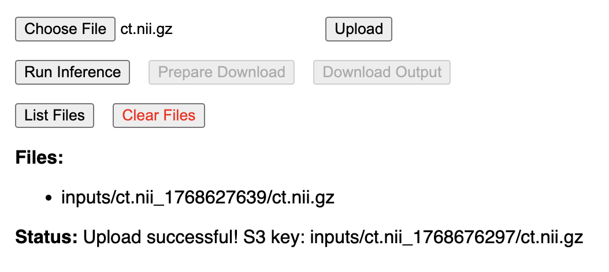
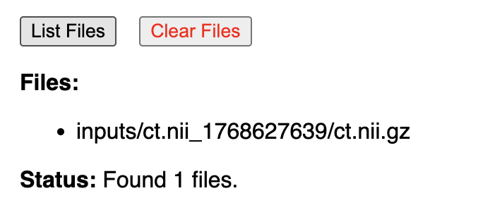

## Motivation

Develop a browser-based method to allow a user to upload CT scan files, run inference using cutting-edge AI model, and download the resulting segmentation files.

## How to Use

0. **Starting the Application**
- Click here to view the application: https://segmentation-demo-6a4h.onrender.com/
- Note: The backend server may take up to a minute to "wake up" if it has been inactive for a while because this is the free tier offering.

1. **File Upload**

- Click "Choose File" to select a file in the format .nii or .nii.gz from your local machine.
- Click "Upload" button on the web interface. This step will take ~1 minute depending on the size of your initial file.

- If successful, a message "Status: Upload successful!" will appear underneath. 
- Click "List Files" to confirm that your file has been uploaded. It will be renamed to follow a "{file_name}_{timestamp}.nii.gz" format.
- You can upload additional files if needed.

2. **Run Inference**

- Click "Run Inference" button on the web interface. If successful, a message "Inference started" will appear. 

- Wait at least 1-2 minutes. The demo .nii.gz file should only take ~1 minute to finish, but because there is no current notification system, please wait a few minutes before proceeding. If you are uploading a much larger initial file, it may take longer, so please be patient!
- Note: The inference model used is documented here: https://huggingface.co/qicq1c/SuPreM

3. **Download Results**
- Click the "Prepare Download" button. This will zip the output segmentation files for easier downloading, and should only take a few seconds.
- Click the "Download Output" button once the message appears that the download is prepared. Files will automatically be downloaded to your local machine in a .zip format which can be unzipped to reveal all outputs.

4. **Optional: Multiple Cases**
- To support multiple cases, you can upload multiple .nii or .nii.gz files before running inference. 
- Click "List Files" if you would like to view what files have already been successfully uploaded.
- Click "Clear Files" to delete all uploaded files from the server and start over.

- Note that running inference will process all uploaded files, so if you would only like to process a single file/different set of files, please only upload those file(s).

## Design & Architecture

This project demonstrates an end-to-end **cloud inference workflow** which is made interactive through a web application. This makes it both scalable for larger or multiple files, and user-friendly for evaluation.

#### Diagram

Below is a high-level architecture diagram illustrating the components and workflow of the application:

#### Application Components:
- **React** for frontend
    - The framework I have most familiarity with, and allows for quick prototyping of web interfaces.
    - A set of a few buttons to trigger backend endpoints and display status messages.
- **Flask** for backend
    - Most straightforward way to use Python for handling file uploads and triggering inference.
    - Contains endpoints for file upload, listing files, running inference, preparing download, and downloading output.
- **Render** for hosting the web application (https://render.com/)
    - Free tier available for hosting small web applications.
    - Offers simple CI/CD from GitHub repositories.

#### Pipeline Components:
- **AWS S3** for file storage
    - This is necessary because the backend cannot directly interact with EC2, so files must be stored in a mutually accessible location.
- **AWS EC2** for running inference on a GPU
    - Instance size: g4dn.xlarge instance with NVIDIA T4 GPU
    - AMI: Deep Learning OSS Nvidia Driver AMI GPU PyTorch 2.9 (Amazon Linux 2023) 20260103
    - EBS: 36 GB to account for storing Docker image (~20 GB), additional packages, and user uploaded input files
- **AWS IAM** for managing permissions
    - EC2 Role: Permissions to read/write/list S3 bucket, and use SSM to allow remote execution
    - S3 Bucket Policy: Allow public read access to output files for downloading
- **AWS Systems Manager (SSM)** for remote execution
    - Allows the Flask backend to remotely trigger inference on the EC2 instance without needing to open additional ports or manage SSH keys.
- **Docker** for pulling the containerized model image.

## Limitations

- EC2: The EC2 instance is not running continuously to save costs.
- File Upload: Current implementation only supports single file upload at a time through the web interface, although multiple files can be uploaded sequentially before running inference. Also, there is no type checking on the file, so it will fail if you upload the wrong file type.
- Hosting on Render: Since this is the free tier of Render, the web application may "sleep" after periods of inactivity, leading to longer wait times for initial requests.
- No Notification System: There is currently no notification system to inform the user when inference is complete. Users must wait a few minutes before preparing the download.
- Security: This is a demo application and does not implement user authentication or secure file handling. It handles the file upload using AWS presigned URLs https://docs.aws.amazon.com/AmazonCloudFront/latest/DeveloperGuide/private-content-signed-urls.html.

## Learnings & Challenges
Previously, I have designed pipeline architectures using AWS services, but this was my first time implementing a full end-to-end solution with a web application interface that is publically available (the local version is more trivial since you can directly use secrets and use the AWS CLI). I came in with the goal of accomplishing the task choosing to optimize for 1) cost and 2) future scalability and best design practices. Here are some of my key learnings and challenges I faced:
- **Hosting**: I learned how to use Render for hosting web applications, which was very straightforward and easy to set up. It's great that secrets can be securely stored in Render and accessed by the application.
- **Security**: I wasn't sure how I was going to security transmit files from the browser into an S3 bucket without exposing my AWS credentials. I learned about presigned URLs which allowed me to securely upload files directly from the browser to S3. I also had to use SSM to securely trigger inference on the EC2 instance without opening additional ports or managing SSH keys on my backend. I needed to update both the IAM role to give permissions to the SSM
- **Cost**: I challenged myself to make this as cheaply as possible. However, it was slightly difficult given the model required a GPU instance to run and is larger (~20 GB). Both the compute and storage required for this exceeded the offerings on the EC2 free tier, so I tried to optimize for cost efficiency in choosing the EC2 instance I provisioned. I also had to provision slightly more EBS storage (30 -> 36 GB) to account for the Docker image size.